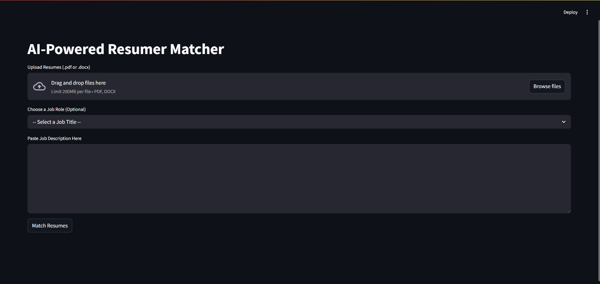
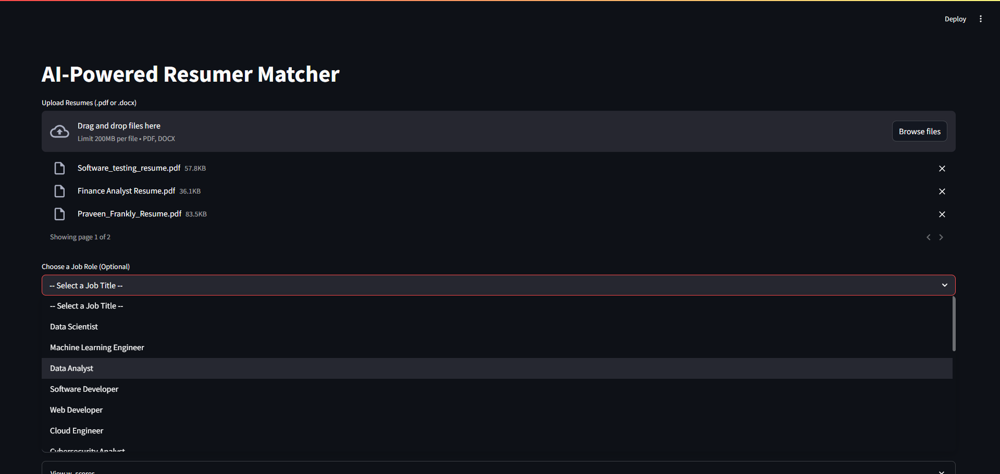
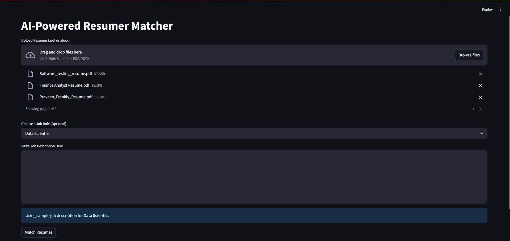
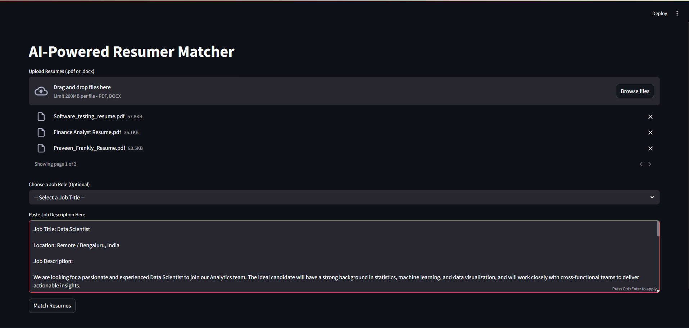
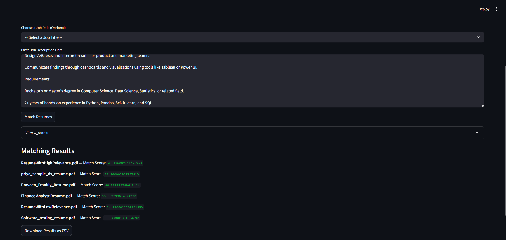
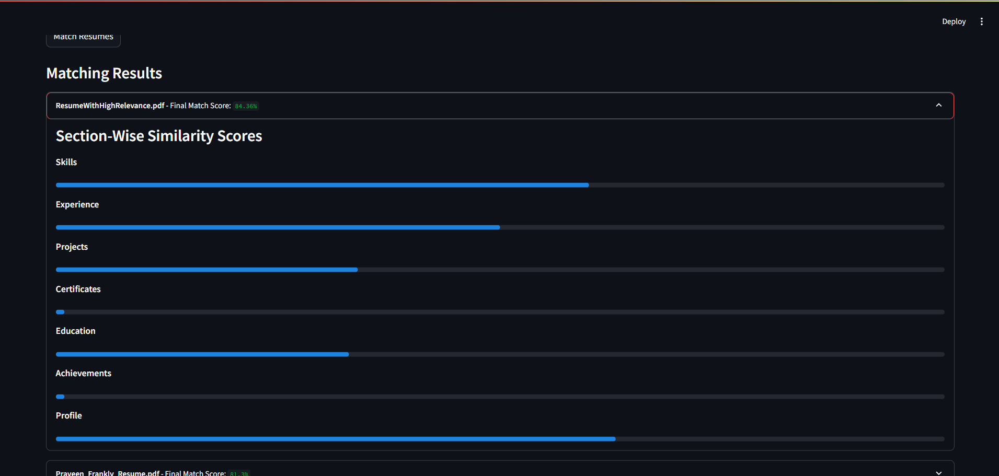

# AI Resume Matcher

## Overview


The **AI Resume Matcher** is an intelligent system that helps to match resumes with job descriptions using advanced machine learning and natural language processing techniques. The tool analyzes resumes and compares them with job descriptions (JD) to provide a match score, along with detailed section-wise similarity scores such as Skills, Experience, Projects, Education, etc.


This project leverages pre-trained models, embeddings, and cosine similarity to perform the analysis. It also integrates NLP techniques such as Named Entity Recognition (NER) for enhanced keyword extraction.

## Features

- **Resume Upload**: Supports the upload of `.pdf` and `.docx` file formats.
- **Job Description Input**: Paste your own job description or select from a set of preloaded sample JDs.
- **Resume Matching**: Automatically matches uploaded resumes to the job description and provides a match score.
- **Section-wise Scores**: Detailed scores for different resume sections (Skills, Experience, Projects, etc.).
- **Downloadable CSV**: Download the results as a CSV for further analysis.
- **Interactive UI**: Built using Streamlit for easy-to-use web interface.

## Tech Stack

- Python
- Streamlit (for the web interface)
- PDFMiner (for PDF text extraction)
- Spacy (for NLP and NER)
- Sentence Transformers (for embedding text)
- scikit-learn (for cosine similarity calculation)

## Results















## Installation

1. Clone the repository:
   ```bash
   git clone https://github.com/your-username/ai-resume-matcher.git
   cd ai-resume-matcher

2. Create a virtual environment (optional but recommended):
   ```bash
   python -m venv venv
   source venv/bin/activate  # On Windows use `venv\Scripts\activate`

3. Install the required dependencies:
   ```bash
   pip install -r requirements.txt
   
4. Download the required Spacy language model:
   ```bash
   python -m spacy download en_core_web_sm

## Usage
1. Upload Resumes: Click the "Upload Resumes" button to upload one or more .pdf or .docx files.

2. Choose Job Role: Optionally, select a job role from the preloaded list of sample job descriptions or paste your own job description in the "Paste Job Description Here" text area.

3. Match Resumes: Click on the "Match Resumes" button to start the analysis. The app will process the resumes, compare them with the job description, and display the match results.

4. Download Results: Once the results are displayed, you can download them as a CSV file containing the match scores and section-wise similarity scores for each resume.
   

## Acknowledgments
Streamlit for providing a simple way to build interactive web apps.

scikit-learn for the machine learning models and cosine similarity functionality.

spaCy for Named Entity Recognition (NER).

Pandas for handling data structures and CSV exports.


Results
